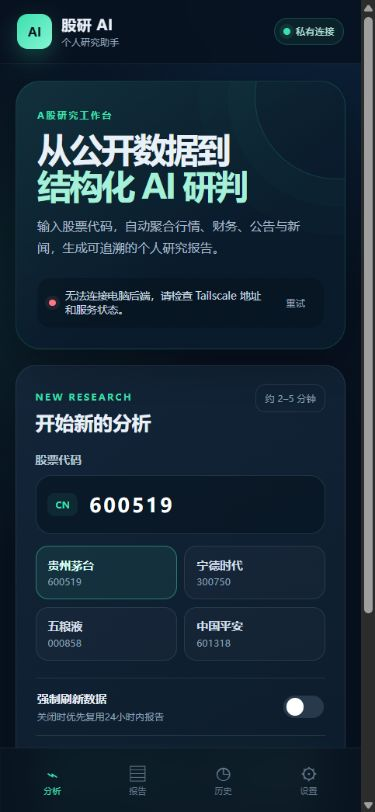
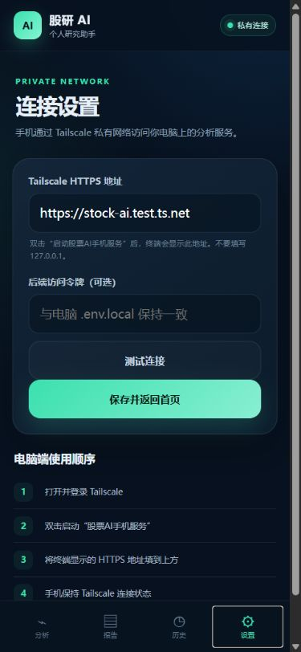
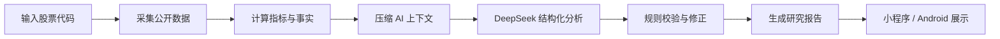
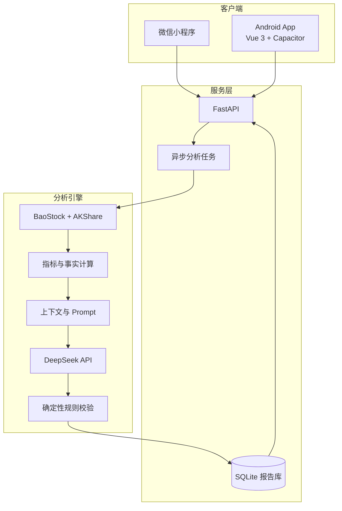

# Stock AI · A股 AI 研究助手

一个从公开市场数据采集、指标计算、AI 推理到多端报告展示的完整 AI 产品原型。

输入沪深 A 股代码，系统会聚合行情、财务、公告与新闻，提取可验证事实，调用 DeepSeek 生成结构化研究报告，并通过规则校验降低模型在评分、均线和关键数字上的幻觉风险。

> 项目定位：个人投研参考与 AI 产品经理求职作品，不构成任何投资建议。

## Android 客户端预览

<p align="center">
  
  &nbsp;&nbsp;
  
</p>

## 项目亮点

- **完整 AI 数据流**：数据获取 → 清洗与缓存 → 指标计算 → 上下文压缩 → 大模型分析 → 规则校验 → 报告展示。
- **多源数据与降级机制**：整合 BaoStock、AKShare；单个数据模块失败时，其余模块继续运行并明确记录缺失项。
- **降低 AI 幻觉**：程序先计算 MA20/60/120、估值分位和综合评分，再校验模型输出中的确定性事实与分数恒等式。
- **异步任务体验**：FastAPI 后端提供任务队列、阶段进度、结果轮询、24 小时报告复用和历史报告查询。
- **多端产品落地**：包含微信小程序原型，以及基于 Vue 3 + Capacitor 的 Android App。
- **可观测的数据质量**：报告同时呈现可用模块、缺失模块、来源状态、限制和校验修正记录。

## 产品流程



任务状态会依次经历：

```text
queued → fetching_data → preparing_context → analyzing → validating → completed
```

## 系统架构



## 核心功能

| 模块 | 能力 |
| --- | --- |
| 数据采集 | 历史行情、估值、财务指标、三大报表、公告与新闻 |
| 量化指标 | MA20/60/120、年化波动率、最大回撤、量能、PE/PB 历史分位 |
| AI 分析 | 基本面、成长性、估值、技术趋势、新闻事件、情景展望与行动清单 |
| 结果校验 | 综合分校验、均线关系校验、程序事实纠错、修正记录 |
| 后端服务 | 异步任务、进度查询、结果缓存、报告持久化、历史记录 |
| 客户端 | 股票搜索、分析进度、结构化报告、历史报告、连接设置 |

## 技术栈

- **后端**：Python、FastAPI、Pandas、SQLite、Uvicorn
- **数据源**：BaoStock、AKShare
- **AI**：DeepSeek OpenAI-compatible API、JSON Schema、结构化 Prompt
- **Android**：Vue 3、Vite、Capacitor
- **微信端**：原生微信小程序
- **部署与连接**：Docker Compose、Tailscale Serve
- **测试**：Python `unittest`，覆盖数据源适配、指标、缓存、API、任务和报告校验

## 快速运行

### 1. 准备 Python 环境

推荐 Python 3.10–3.12，在 Windows PowerShell 中执行：

```powershell
git clone https://github.com/Horshey123/stock-ai-research-assistant.git
cd stock-ai
.\scripts\setup.ps1
```

### 2. 配置环境变量

```powershell
Copy-Item .env.local.example .env.local
notepad .env.local
```

填写：

```dotenv
DEEPSEEK_API_KEY=你的密钥
DEEPSEEK_BASE_URL=https://api.deepseek.com
DEEPSEEK_MODEL=deepseek-v4-pro
```

`.env.local` 已加入 `.gitignore`，请勿提交真实密钥。

### 3. 启动后端

双击：

```text
双击启动股票AI后端.bat
```

或在 PowerShell 中执行：

```powershell
.\.venv\Scripts\python.exe -m uvicorn stock_ai.api.main:app --reload --port 8000
```

启动后访问：

- Swagger：`http://127.0.0.1:8000/docs`
- 健康检查：`http://127.0.0.1:8000/api/v1/health`

### 4. 生成分析报告

命令行完整采集并分析：

```powershell
.\.venv\Scripts\python.exe -m stock_ai 600519 --analyze --no-cache
```

只采集数据：

```powershell
.\.venv\Scripts\python.exe -m stock_ai 600519 --skip-news --skip-reports --no-cache
```

## API 示例

创建分析任务：

```http
POST /api/v1/analysis-jobs
Content-Type: application/json

{
  "code": "600519",
  "refresh_data": false,
  "reuse_hours": 24
}
```

主要接口：

```text
GET  /api/v1/health
POST /api/v1/analysis-jobs
GET  /api/v1/analysis-jobs/{job_id}
GET  /api/v1/reports/{report_id}
GET  /api/v1/stocks/{code}/latest-report
GET  /api/v1/stocks/{code}/reports
```

## Android App

Android 客户端位于 `mobile/`，通过 Tailscale 私有网络访问电脑上的后端。

```powershell
cd mobile
pnpm install
pnpm build
pnpm exec cap sync android
```

项目提供两个 Windows 快捷入口：

```text
双击启动股票AI手机服务.bat
双击生成安卓安装包.bat
```

详细步骤见 [`手机App使用说明.md`](./手机App使用说明.md)。

## 微信小程序

微信小程序代码位于 `miniprogram/`，已实现：

- 股票代码输入与任务提交
- `queued` 到 `completed` 的进度轮询
- AI 报告详情页
- 最近报告读取

开发者需在微信开发者工具中填写自己的 AppID 和后端地址。

## 测试

```powershell
$env:PYTHONPATH = "$PWD\src"
.\.venv\Scripts\python.exe -m unittest discover -s tests -v
```

当前测试覆盖：

- BaoStock、AKShare 数据源适配
- 股票代码与市场识别
- 技术指标与估值分位
- 缓存与报告数据库
- FastAPI 任务生命周期与 CORS
- DeepSeek 请求和结构化结果
- 评分、均线与事实校验

## 项目结构

```text
stock-ai/
├─ src/stock_ai/           # 数据、分析、校验与 API 核心代码
├─ tests/                  # 自动化测试
├─ mobile/                 # Vue 3 + Capacitor Android 客户端
├─ miniprogram/            # 微信小程序客户端
├─ scripts/                # 初始化、启动和打包脚本
├─ deploy/                 # 服务端环境变量模板与初始化脚本
├─ Dockerfile
└─ compose.yaml
```

## 当前限制

- 当前仅支持沪深 A 股，不包含北交所、港股、美股、ETF 与可转债。
- AKShare 的部分数据来自公开网页接口，上游调整或访问频率可能导致临时失败。
- AI 输出用于辅助研究，不能替代原始公告、财报核验和独立投资判断。

## 后续规划

- [ ] 首页每日市场新闻和指数行情
- [ ] 自选股与定时更新
- [ ] 多股票横向对比
- [ ] 报告中的数据来源跳转与证据引用
- [ ] 组合跟踪和复盘记录
- [ ] Android 正式签名与版本发布
